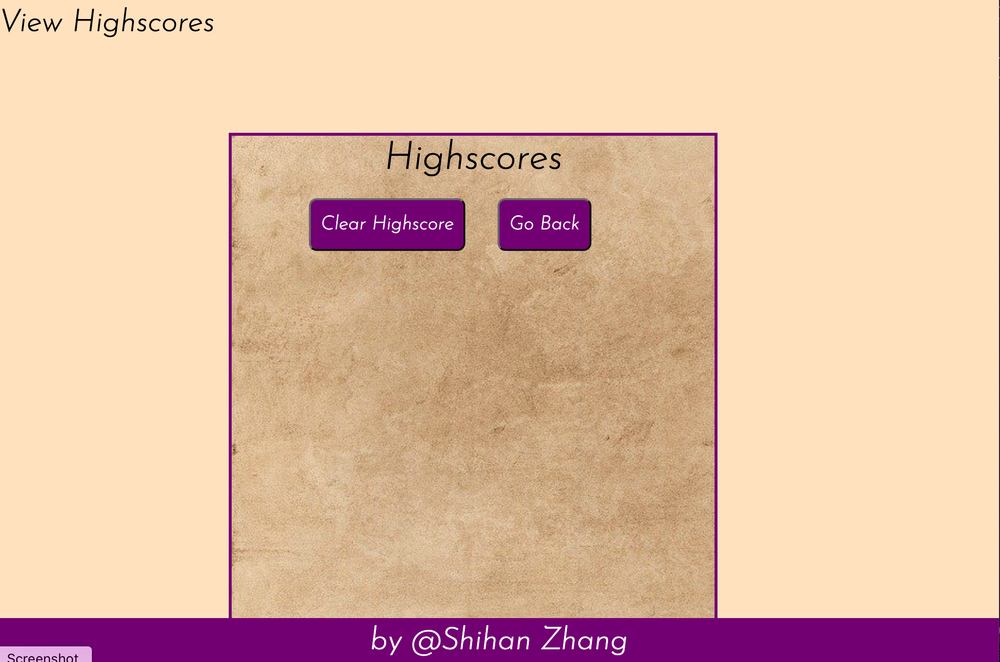

# 04 Web APIs: Code Quiz
* Website deployed at https://corazhang.github.io/Code-Quiz/
* As you proceed in your career as a web developer, you will probably be asked to complete a coding assessment, which is typically a combination of multiple-choice questions and interactive challenges. Build a timed code quiz with multiple-choice questions. This app will run in the browser and feature dynamically updated HTML and CSS powered by your JavaScript code. It will also feature a clean and polished user interface and be responsive, ensuring that it adapts to multiple screen sizes.

## What is done
* Added a button to Start the quiz and the timer
* Added a timer of 50 seconds to complete all questions. When the timer reaches 0, the test will end automatically
* The next questions will present after the user finish the previous one
* If the user answer the questions incorrectly, 10 seconds will be deducted from total time avaliable and there will be an alarm sound
* When the game is over, the user will be able to save their initials and scores
* Added a button to clear all saved scores
* Added a button to go back to the start page
* Added media queries to fit into smaller screen
* Added a sticky footer
* Added audio, play different sounds when the user answer the question correctly and incorrectly

## User Story

```
AS A coding bootcamp student
I WANT to take a timed quiz on JavaScript fundamentals that stores high scores
SO THAT I can gauge my progress compared to my peers
```

## Acceptance Criteria

```
GIVEN I am taking a code quiz
WHEN I click the start button
THEN a timer starts and I am presented with a question
WHEN I answer a question
THEN I am presented with another question
WHEN I answer a question incorrectly
THEN time is subtracted from the clock
WHEN all questions are answered or the timer reaches 0
THEN the game is over
WHEN the game is over
THEN I can save my initials and score
```

The following Screenshots demonstrates the application functionality:




